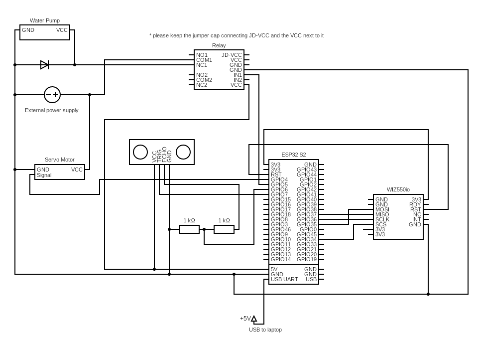

# ESP32

This lab can be linked to a real life model. 

In this case, I used an esp32-s2 dev kit and the sketch [`dam_esp32.ino`](dam_esp32.ino).

## Installation

1. Download Arduino IDE

2. Install the ESP32 add-on in Arduino IDE, as well as the following libraries:
- ESP32 Servo: https://github.com/madhephaestus/ESP32Servo
- Modbus esp8266: https://github.com/emelianov/modbus-esp8266 

3. Open [`dam_esp32.ino`](dam_esp32.ino), and upload to your ESP32 board
 
## Wiring

1. ESP32 
2. Ethernet shield [WIZ550io](https://docs.wiznet.io/Product/ioModule/wiz550io)  
    - Connects the ESP32 to the laptop via ethernet 
    - Interact via Modbus TCP 
3. Servo motor 
    - Controls the dam gate 
    - Corresponds to coil address 1 
4. Water pump w/ relay 
    - Pumps water from downstream to upstream 
    - Corresponds to coil address 0 
5. Ultrasonic sensor 
    - Detects the water level upstream and subsequently adjust the gate and pump 
        - When the water level is too low, turn on the pump and close the gate. 
        - When the water level is too high, turn off the pump and open the gate. 
    - Corresponds to input register address 0 

